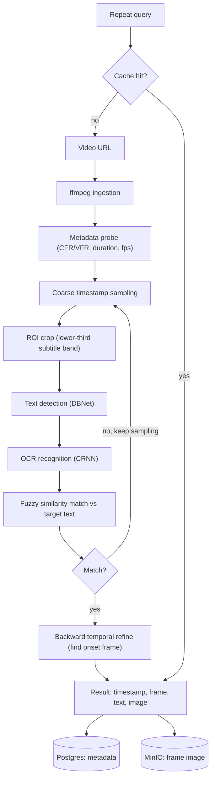
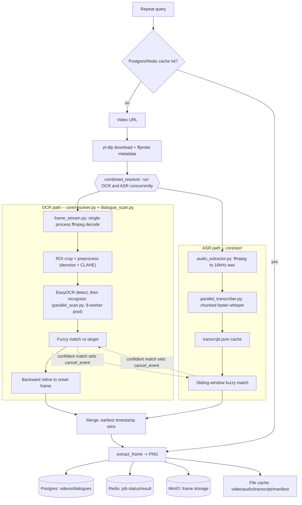

# Approach - Multimodal Dialogue Localization

This document is the "how I actually thought about this" companion to
`DESIGN.md` (the technical architecture reference). The assignment asks four
specific questions - where to look, how to pin the exact frame, how to
extract the text, how to handle ambiguity - so I've segmented the whole
problem statement along exactly those four lines, and describe how my
understanding of each one changed as I worked through it with an AI coding
assistant.

## 1. Objective

The system is designed to identify the first occurrence of a given dialogue
in a video, regardless of whether the dialogue appears as on-screen text or
is only spoken in the audio.

## How I read the problem statement

The assignment says "an on-screen dialogue appears" and asks for the frame
where it "first appears." Read literally, that's an OCR problem: walk the
video, look for text, match it, stop. That's the assumption I started from,
and it's also the assumption the existing pipeline I inherited was built on
- a coarse-interval OCR scan with backward refinement to pin the exact onset
frame. My first pass at understanding the codebase was making sure I
actually understood *that* pipeline correctly before touching anything:

- Does it stop at the first match, or keep going? (it stops - `stop_at_first`)
- If the coarse sampling interval steps over a short-lived line, is there
  any way to catch that, or is it just gone? (there wasn't - this became the
  first real gap I pushed on, leading to the optional change-detection
  pre-pass)

I only started making changes once I could explain the existing control
flow back correctly, not before.

## Sub-problem 1: where to look in the video

My initial mental model was "OCR, at some interval, until a match." Two
things changed that:

1. **Performance forced the question of *where in the video* to spend
   compute, not just *how to search*.** The real assignment video is ~54
   minutes. A naive OCR-every-frame approach is off the table by orders of
   magnitude, so "where to look" isn't just "start at t=0" - it's coarse
   sampling (check a sparse set of candidate timestamps first), spatial
   cropping (only look in the region dialogue would appear, not the whole
   frame), and stopping the instant an answer is found rather than
   continuing to scan. I pushed on making all three of those actually
   correct and actually fast, not just present - profiling before
   optimizing (I asked *why* it was slow before accepting *that* it was
   slow, and had the AI assistant measure per-stage cost on the real video
   rather than guess).

2. **The bigger correction: I watched the actual video and there was no
   on-screen caption at all.** The line is spoken, not shown. That's the
   single most important judgment call in this whole exercise - the
   assignment's literal wording ("on-screen dialogue") pointed one direction,
   but the actual evaluation video pointed another, and a solution that only
   trusts the spec's wording would have scanned that video forever and never
   found anything. So "where to look" isn't only "which timestamps in the
   video" - it's "which *channel* (visual vs. audio) actually carries the
   dialogue," and I don't think that's knowable in advance for an arbitrary
   URL. That's why the final design runs OCR and speech-to-text
   *concurrently* and lets whichever one actually finds something win,
   rather than picking one modality upfront based on the spec's wording. The
   assignment explicitly says a different video may be used for evaluation,
   which is exactly the case this design is defending against - I didn't
   want a solution that only works for the one video I happened to test.

## Sub-problem 2: how to determine the relevant/exact frame

Once *something* has plausibly matched (an OCR hit or a spoken match), the
question is what counts as "the frame." For OCR, a coarse hit only tells you
"the text is present somewhere in this ~1-3 second window" - it doesn't tell
you the onset. I wanted the reported frame to be the actual first frame the
text is visible on, not just wherever the coarse sampler happened to land,
so the design steps backward from a coarse hit in fine increments until the
text is no longer present, and reports the last frame it *was* present on.
That's a deliberate precision choice: coarse-and-cheap to find the
neighborhood, fine-and-expensive only in the small window where it actually
matters.

For ASR, "the frame" is the moment the speaker starts the matched phrase -
the transcript segment's start timestamp, mapped to a frame number the same
way the video's frame rate maps any timestamp to a frame.

## Sub-problem 3: how to extract the text

Two extraction problems, not one, once the video turned out to be
audio-only for its actual dialogue:

- **On-screen text**: detection + recognition (EasyOCR's DBNet + CRNN) over
  a cropped, denoised, contrast-boosted region - not the raw full frame,
  since a fixed-position dialogue band means the rest of the frame is just
  noise for this purpose.
- **Spoken text**: speech-to-text (`faster-whisper`) over the extracted
  audio track, chunked and run in parallel rather than as one long serial
  pass, once I'd confirmed the accuracy trade-off of a smaller/faster model
  was acceptable for *matching* purposes (I don't need a perfect
  transcript, I need something a fuzzy matcher can recognize the target
  phrase in).

Both funnel into the same fuzzy-matching step (`rapidfuzz`) rather than two
separate matching implementations - OCR misreads and ASR misrecognitions are
the same *kind* of problem (the extracted text is approximately, not
exactly, right), so I wanted one matching strategy, not two.

## Sub-problem 4: handling ambiguous or uncertain results

A few distinct kinds of uncertainty, handled differently on purpose:

- **Low-confidence match** (similarity below threshold): reported as
  `matched: false` with the closest candidate attached, never silently
  dropped. I wanted a failed run to be inspectable, not just a blank result.
- **Two disagreeing sources** (OCR and ASR both find something): resolved by
  "the dialogue that first appears" - earliest timestamp wins, consistent
  with the assignment's own framing of the task.
- **One source crashes** (this happened for real - see below): treated as
  "no match from that source," not as a fatal error for the whole request.
  I didn't want a transient failure in one detector to silently produce a
  wrong answer *or* to take down an answer the other detector already had.
- **Repeated dialogue** (the same line appearing more than once): the
  resolver supports reporting every occurrence, not just the first, even
  though the current UI only surfaces the first - I kept that path working
  and tested rather than removing it, specifically because the assignment
  says the requirement might change in the interview.

## Architecture: initial design vs. what actually shipped

The design-phase diagram was OCR-only, matching a literal reading of "an
on-screen dialogue appears": ingest, sample, crop to the dialogue region,
detect and recognize text, fuzzy-match, refine to the onset frame, cache the
result.

That design was correct as far as it went, but it only goes as far as
on-screen text. What actually shipped adds a second, independent detector
for spoken dialogue, runs both concurrently instead of picking one upfront,
and merges whichever answers first:

The shape didn't change much (ingest, detect, match, refine, cache) - what
changed is that "detect" is now two independent paths racing each other
instead of one, with a cancellation signal between them so the slow path
doesn't keep running once the fast path already has the answer.

## What actually happened along the way (and why it matters)

I didn't get a working, fast, correct pipeline by asking for it once. The
sequence that got there is itself part of the approach:

1. Understood the existing pipeline's control flow before changing it.
2. Found and closed a real coverage gap (short-lived on-screen text falling
   between coarse sampling ticks).
3. Ran it against the real assignment video and it was unacceptably slow -
   instead of accepting that, pushed for root-cause profiling (per-stage
   timing on the actual video) rather than guessing at fixes. That profiling
   is what found that OCR's own detection step, not frame extraction, was
   >90% of the cost.
4. Scoped the first round of fixes deliberately narrow ("only the cheap
   changes") before committing to a bigger parallel rewrite - cheaper
   changes first, escalate only once they're proven insufficient.
5. Caught a real correctness regression in my own earlier optimization (an
   OCR "skip if nothing detected" pre-filter that accidentally doubled
   detection cost on frames *with* text) by re-checking measured numbers
   rather than trusting that a plausible-sounding optimization worked.
6. Watched the actual video and recognized the on-screen-text assumption was
   simply wrong for this case - the pivot to speech-to-text follows directly
   from that, not from the spec.
7. Chose to run OCR and ASR *concurrently* rather than sequentially or
   ASR-only, specifically so the design still works if a different
   evaluation video *does* have real captions.
8. Hit two real infrastructure failures under load - a dev-server
   auto-reload silently killing an in-flight job, and a memory-pressure
   crash from running both detectors' worker pools at once - and treated
   both as bugs to fix (graceful degradation, safer resource defaults), not
   one-off flukes to route around.
9. Verified every optimization claim against the real video before believing
   it: timing before/after the coarse-interval change, before/after the
   ASR model swap, before/after chunked transcription, and - critically -
   didn't accept "cancellation should work" until the server log actually
   showed the cancellation firing.
10. Confirmed the caching layers (download, audio, transcript, DB, Redis)
    were genuinely populated and correct after a real successful run, not
    just assumed present because the code looked right.

The throughline: prefer a measured answer to a plausible-sounding one, and
treat "it works" as something to demonstrate on the actual evaluation video,
not something to infer from the code.
